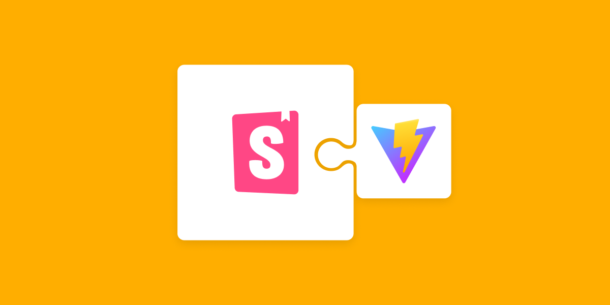

<h1 align="center">

</h1>
# Storybook-React

Projeto em React criado com Vite para fixar meus conhecimentos sobre a ferramenta de documentação Storybook

instale o yarn

digite yarn para baixar

yarn storybook
